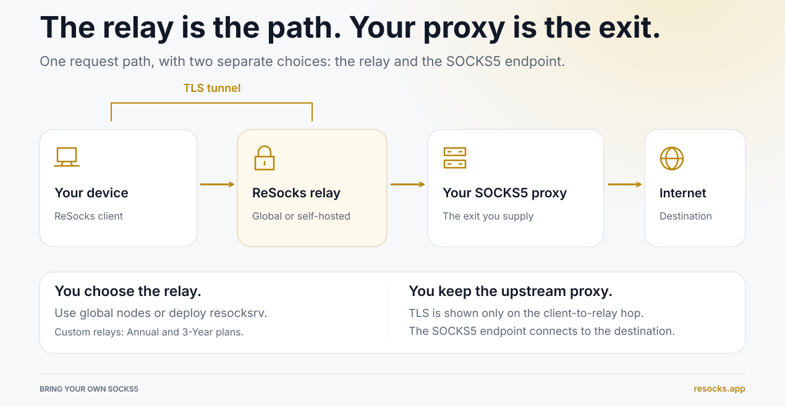
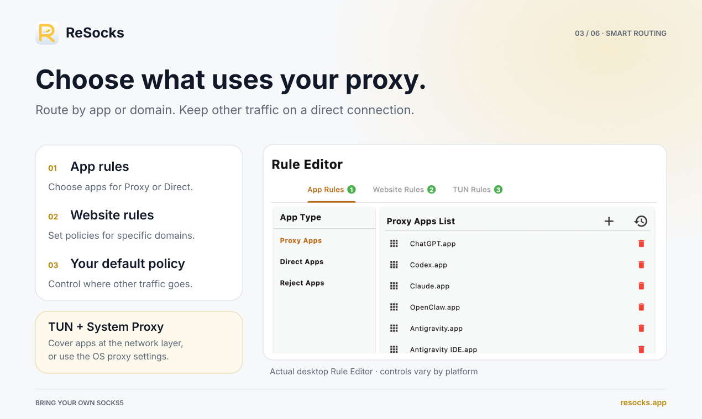

# ReSocks

[中文说明](./README.zh-CN.md) | English

## What is ReSocks?

> A TLS relay for your SOCKS5 proxy.

ReSocks lets you bring your own SOCKS5 proxy — residential, mobile, or third-party — and reach it through a TLS-encrypted relay. You keep the exit node you already chose, and decide which apps and websites use it.

**[Download ReSocks](https://resocks.app/download?utm_source=github)**

**Device → TLS relay → your SOCKS5 proxy → internet**





Set per-app and per-site rules so selected apps or domains route through the proxy while everything else connects directly.

The ReSocks client is built with Flutter for the UI and a C core for its networking engine, keeping the installer under 50 MB while running natively on macOS, Windows, Linux, Android, HarmonyOS, and iOS.

### Key features

- **Bring your own proxy** — use your own, residential, mobile, or third-party SOCKS5 endpoint, and keep your choice of provider.
- **TLS-protected relay connection** — encrypt traffic between your device and the relay, protecting it from local network observers.
- **TUN or system proxy mode** — TUN mode covers apps that ignore system proxy settings; system proxy mode works with proxy-aware apps.
- **App and site routing** — send selected apps or domains through the proxy while everything else connects directly.
- **Global relay nodes, or self-host** — use ReSocks' global relays, or deploy `resocksrv` on your own server with an Annual or 3-Year plan.
- **Cross-platform** — macOS, Windows, Linux, iOS, Android, and HarmonyOS, with one account across up to eight devices online at once.
- **No relay data cap** — paid plans have no relay data cap (subject to your own proxy or hosting provider's limits).
- **LAN proxy sharing** — share your connection via HTTP/HTTPS with compatible laptops, TVs, or consoles.

### Use cases

- Your network cannot reach your SOCKS5 proxy directly.
- Direct access is slow, and the relay gets you a faster route.
- Some apps or sites need a proxy. Others should connect directly.
- You already have a residential or mobile SOCKS5 endpoint.
- You want TLS protection between your device and relay on public Wi-Fi.
- You want to host and manage your own relay.

### Who it's for

Developers and QA testing regional access, residential/mobile proxy users, self-hosters, remote workers, international teams, privacy-conscious users, and anyone who already has a SOCKS5 proxy but needs a safer or more flexible way to reach it.

### Learn more

Learn more, watch the demo, or download the app at **[resocks.app](https://resocks.app?utm_source=github)**.

## Custom Relay Server Setup Guide

Optional. ReSocks supports using a **self-deployed relay server** for SOCKS5 relaying, instead of relying on the official fixed nodes. By deploying `resocksrv`, you have full control over your own relay path, gaining greater security and flexibility.

### Prerequisites

- A publicly accessible server (VPS) with Docker and Docker Compose installed
- A domain name pointed to that server, with an HTTPS certificate already configured (for use with an Nginx reverse proxy)
- Basic experience with the Linux command line and Nginx configuration

---

### 1. Download the package

Download the complete `resocksrv` directory (including the Dockerfile, docker-compose.yml, etc.):

```
https://resocks.app/down/resocksrv.zip
```

If you're logged into your server over SSH, you can download, extract, and enter the directory directly on the server:

```sh
wget https://resocks.app/down/resocksrv.zip
unzip resocksrv.zip
cd resocksrv
```

---

### 2. Environment variables

| Variable | Description | Default |
| --- | --- | --- |
| `OVER_TLS_PATH` | over_tls path (maps to `over_tls_settings.path`) | **Required, no default** |
| `LISTEN_HOST` | Listen address inside the container | `0.0.0.0` |
| `LISTEN_PORT` | Listen port | `8388` |
| `UDP` | Whether to enable UDP relaying (`true`/`false`) | `true` |
| `IDLE_TIMEOUT` | Idle connection timeout (seconds) | `300` |
| `CONNECT_TIMEOUT_MS` | Connect timeout (milliseconds; auto-converted to seconds in the config file) | `6000` |
| `MONITOR_INTERVAL` | Health check polling interval (seconds) | `30` |

> [!WARNING]
> `OVER_TLS_PATH` **must** be set explicitly. If it's missing or empty, `entrypoint.sh` will print an error and exit immediately.

---

### 3. Build the image

```sh
docker build -t resocksrv:latest .
```

---

### 4. Run with docker run

#### Option 1: Bind to 127.0.0.1 only (recommended, with an Nginx reverse proxy on the host)

`LISTEN_HOST` inside the container should still remain `0.0.0.0` (otherwise the container can't listen at all); external access is restricted via the host-side bind address in `-p`:

```sh
docker run -d \
    --name resocksrv \
    -e LISTEN_PORT=8388 \
    -e OVER_TLS_PATH=/your-secret-path/ \
    -p 127.0.0.1:8388:8388 \
    resocksrv:latest
```

With this configuration, the port is only reachable from the server itself. Nginx can listen on the public port and reverse-proxy to `127.0.0.1:8388` using the same path as `OVER_TLS_PATH`.

#### Option 2: Expose on all network interfaces

```sh
docker run -d \
    --name resocksrv \
    -e LISTEN_PORT=8388 \
    -e OVER_TLS_PATH=/your-secret-path/ \
    -p 8388:8388 \
    resocksrv:latest
```

---

### 5. Or run with docker-compose

The `docker-compose.yml` in the package builds the image locally (`build: context: .`) and binds to `127.0.0.1:8388`. Before starting, update `OVER_TLS_PATH` (and any other variables you need):

```yaml
services:
  resocksrv:
    build:
      context: .
      args:
        VERSION: 1.0.0
    container_name: resocksrv
    restart: unless-stopped
    environment:
      LISTEN_HOST: 0.0.0.0
      LISTEN_PORT: 8388
      UDP: "true"
      IDLE_TIMEOUT: 300
      CONNECT_TIMEOUT_MS: 6000
      OVER_TLS_PATH: /your-secret-path/   # Required; must match the path configured in the Nginx reverse proxy.
      MONITOR_INTERVAL: 30
    ports:
      - "127.0.0.1:8388:8388/tcp"
```

Then build and start it:

```sh
docker compose up -d --build
```

---

### 6. Configure Nginx (HTTPS reverse proxy)

The `over_tls` path only makes sense **inside an HTTPS `server` block** — it relies on TLS to disguise the traffic. Add the following `location` block to your existing HTTPS `server` block (the path must match `OVER_TLS_PATH`):

```nginx
server {
    listen 443 ssl;
    server_name your-domain.com;

    ssl_certificate     /path/to/fullchain.pem;
    ssl_certificate_key /path/to/privkey.pem;

    location /your-secret-path/ {
        proxy_redirect off;
        proxy_pass http://127.0.0.1:8388;
        proxy_http_version 1.1;
        proxy_set_header Upgrade $http_upgrade;
        proxy_set_header Connection "upgrade";
        proxy_set_header Host $http_host;
    }

    # All other paths can point to your real website, or a decoy site
    location / {
        root /var/www/your-site;
    }
}
```

> [!WARNING]
> - `/your-secret-path/` must exactly match `OVER_TLS_PATH`.
> - This `location` block must live under a `listen 443 ssl` server block — plain HTTP (port 80) won't work properly with `over_tls`.
> - Other paths (`location /`) can point to your normal site or a decoy site, so the domain looks like an ordinary website to outside observers.

---

### 7. Managing the container

```sh
docker logs resocksrv              # View logs
docker exec resocksrv /monitor.sh  # Manually trigger a health check
docker stop resocksrv              # Stop
docker rm resocksrv                # Remove (required before reusing the same --name)
```

If started via Compose:

```sh
docker compose down
```

---

### 8. Using it in the ReSocks client

Once deployed, go back to the ReSocks client:

1. Go to **Dashboard → Server selection → Custom relay server**
2. Add the domain/address you deployed, along with the configured `OVER_TLS_PATH` path
3. Save, select this relay server, and click **Connect**

## Website deployment

### Tech stack

- [Nuxt 3](https://nuxt.com)
- [@nuxtjs/i18n](https://i18n.nuxtjs.org/) for English/Chinese localization
- [@nuxt/content](https://content.nuxt.com/) for the documentation pages
- [Tailwind CSS](https://tailwindcss.com/)
- [@nuxtjs/sitemap](https://nuxtseo.com/sitemap)

### Prerequisites

- [Node.js](https://nodejs.org/) 18 or later
- npm (or your preferred package manager)

### Setup

```bash
# Clone the repository
git clone https://github.com/YOUR_ORG/YOUR_REPO.git
cd YOUR_REPO

# Install dependencies
npm install
```

### Development

Start the development server at `http://localhost:3000`:

```bash
npm run dev
```

### Production

Build the application for production:

```bash
npm run build
```

Locally preview the production build:

```bash
npm run preview
```

Or generate a fully static site:

```bash
npm run generate
```

See the [Nuxt deployment documentation](https://nuxt.com/docs/getting-started/deployment) for more deployment options.
