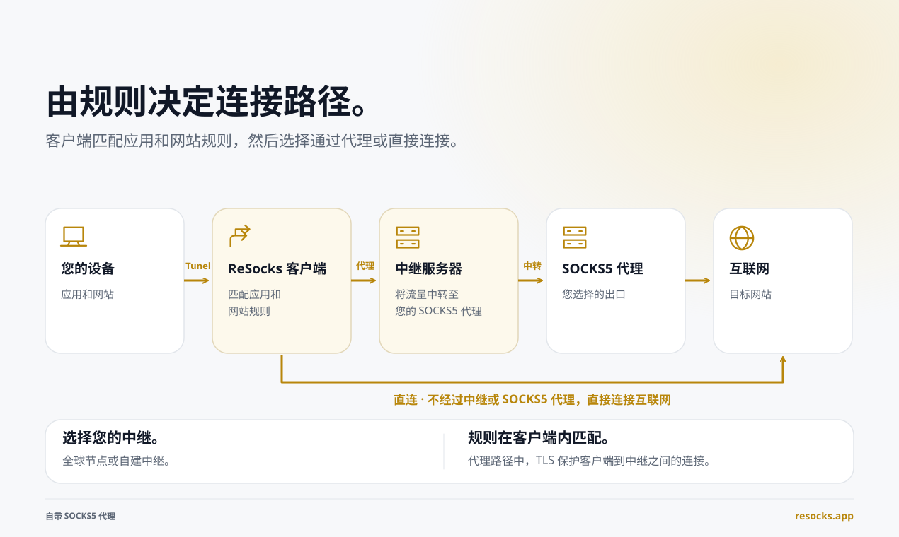
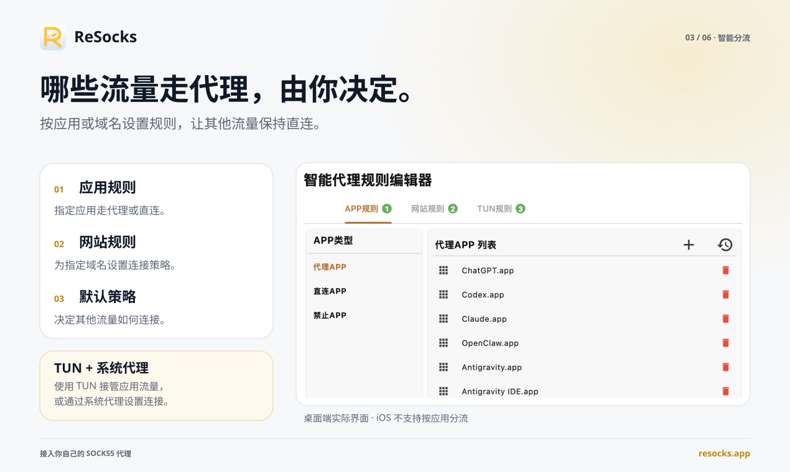

# ReSocks

中文说明 | [English](./README.md)

## ReSocks 是什么？

> 为你的 SOCKS5 代理提供 TLS 中转。

ReSocks 让你可以带上自己的 SOCKS5 代理——无论是住宅代理、移动代理还是第三方代理——通过 TLS 加密的中转节点来访问它。你依然使用自己选择的出口节点，并可以自由决定哪些应用和网站走这条代理。

**[ 下载 ReSocks](https://resocks.app/download?utm_source=github)**

**设备 → TLS 中转 → 你的 SOCKS5 代理 → 互联网**





设置按应用和按网站的规则，让指定的应用或域名走代理，其余流量直连。

ReSocks 客户端基于 Flutter 构建界面，核心网络引擎使用 C 编写，安装包体积不超过 50MB，原生支持 macOS、Windows、Linux、Android、鸿蒙和 iOS 平台。

### 核心特性

- **带上自己的代理** — 使用你自己的、住宅、移动或第三方 SOCKS5 端点，保留你选择的服务商。
- **TLS 加密中转连接** — 加密设备到中转节点之间的流量，防止本地网络被监听。
- **TUN 或系统代理双模式** — TUN 模式覆盖不遵循系统代理设置的应用；系统代理模式适用于支持代理的应用。
- **应用与网站分流** — 让指定的应用或域名走代理，其余流量直连。
- **全球中转节点，或自建中转** — 使用 ReSocks 的全球中转节点，或在年付/三年付套餐下将 `resocksrv` 部署到你自己的服务器。
- **跨平台支持** — 支持 macOS、Windows、Linux、iOS、Android 和 HarmonyOS，一个账号最多可同时在 8 台设备上在线。
- **中转流量无上限** — 付费套餐的中转流量没有上限（受你自己的代理或托管服务商限制）。
- **局域网代理共享** — 通过 HTTP/HTTPS 与兼容的笔记本、电视或游乐机共享连接。

### 使用场景

- 你的网络无法直接访问你的 SOCKS5 代理。
- 直连速度较慢，通过中转获取更快访问速度。
- 部分应用或网站需要走代理，其余应该直连。
- 你已经拥有一个住宅或移动 SOCKS5 端点。
- 你希望在公共 Wi-Fi 上为设备到中转节点之间的连接提供 TLS 保护。
- 你想自己托管并管理中转节点。

### 适用人群

需要测试地区访问的开发者与测试人员、住宅/移动代理用户、自托管用户、远程办公者、跨国团队、注重隐私的用户，以及任何已经拥有 SOCKS5 代理、但需要更安全或更灵活方式去访问它的人。

### 了解更多

更多信息、演示视频与下载，请访问 **[resocks.app](https://resocks.app?utm_source=github)**。

## 自定义中转服务器（Relay Server）搭建指南

可选功能，ReSocks 支持使用**自己部署的中转服务器**进行 SOCKS5 中转（Relay），而不依赖官方提供的固定节点。通过部署 `resocksrv`，您可以完全掌控自己的中转链路，获得更高的安全性和灵活性。

### 前置条件

- 一台可公开访问的服务器（VPS），已安装 Docker 和 Docker Compose
- 一个已解析到该服务器的域名，并已配置好 HTTPS 证书（用于配合 Nginx 反向代理）
- 基本的 Linux 命令行和 Nginx 配置经验

---

### 1. 下载程序包

下载 `resocksrv` 的完整目录（包含 Dockerfile、docker-compose.yml 等文件）：

```
https://resocks.app/down/resocksrv.zip
```

如果您是通过 SSH 登录服务器进行操作，可以直接在服务器上执行以下命令完成下载、解压并进入目录：

```sh
wget https://resocks.app/down/resocksrv.zip
unzip resocksrv.zip
cd resocksrv
```

---

### 2. 环境变量说明

| 变量 | 说明 | 默认值 |
| --- | --- | --- |
| `OVER_TLS_PATH` | over_tls 路径（对应 `over_tls_settings.path`） | **必填，无默认值** |
| `LISTEN_HOST` | 容器内部监听地址 | `0.0.0.0` |
| `LISTEN_PORT` | 监听端口 | `8388` |
| `UDP` | 是否启用 UDP 中转（`true`/`false`） | `true` |
| `IDLE_TIMEOUT` | 空闲连接超时时间（秒） | `300` |
| `CONNECT_TIMEOUT_MS` | 连接超时时间（毫秒，配置文件中会自动转换为秒） | `6000` |
| `MONITOR_INTERVAL` | 健康监测轮询间隔（秒） | `30` |

> [!WARNING]
> `OVER_TLS_PATH` **必须**显式设置。如果缺失或为空，`entrypoint.sh` 会打印错误并立即退出。

---

### 3. 构建镜像

```sh
docker build -t resocksrv:latest .
```

---

### 4. 使用 docker run 运行

#### 方式一：仅绑定 127.0.0.1（配合宿主机 Nginx 反向代理，推荐）

容器内部的 `LISTEN_HOST` 仍需保持 `0.0.0.0`（否则容器内无法监听），对外访问的限制是通过 `-p` 的宿主机绑定地址来实现的：

```sh
docker run -d \
    --name resocksrv \
    -e LISTEN_PORT=8388 \
    -e OVER_TLS_PATH=/your-secret-path/ \
    -p 127.0.0.1:8388:8388 \
    resocksrv:latest
```

这样配置后，该端口只能从服务器本机访问。Nginx 可以监听公网端口，并使用与 `OVER_TLS_PATH` 相同的路径反向代理到 `127.0.0.1:8388`。

#### 方式二：暴露到所有网络接口

```sh
docker run -d \
    --name resocksrv \
    -e LISTEN_PORT=8388 \
    -e OVER_TLS_PATH=/your-secret-path/ \
    -p 8388:8388 \
    resocksrv:latest
```

---

### 5. 或使用 docker-compose 运行

程序包目录中的 `docker-compose.yml` 会在本地构建镜像（`build: context: .`），并绑定到 `127.0.0.1:8388`。启动前请先修改 `OVER_TLS_PATH`（以及其他需要的变量）：

```yaml
services:
  resocksrv:
    build:
      context: .
      args:
        VERSION: 1.0.0
    container_name: resocksrv
    restart: unless-stopped
    environment:
      LISTEN_HOST: 0.0.0.0
      LISTEN_PORT: 8388
      UDP: "true"
      IDLE_TIMEOUT: 300
      CONNECT_TIMEOUT_MS: 6000
      OVER_TLS_PATH: /your-secret-path/   # 必填；需与 Nginx 反向代理中配置的路径一致。
      MONITOR_INTERVAL: 30
    ports:
      - "127.0.0.1:8388:8388/tcp"
```

然后构建并启动：

```sh
docker compose up -d --build
```

---

### 6. 配置 Nginx（HTTPS 反向代理）

`over_tls` 路径只有在**HTTPS 的 `server` 块内**才有意义——它依赖 TLS 来伪装流量。请在您现有的 HTTPS `server` 块中添加以下 `location`（路径需与 `OVER_TLS_PATH` 保持一致）：

```nginx
server {
    listen 443 ssl;
    server_name your-domain.com;

    ssl_certificate     /path/to/fullchain.pem;
    ssl_certificate_key /path/to/privkey.pem;

    location /your-secret-path/ {
        proxy_redirect off;
        proxy_pass http://127.0.0.1:8388;
        proxy_http_version 1.1;
        proxy_set_header Upgrade $http_upgrade;
        proxy_set_header Connection "upgrade";
        proxy_set_header Host $http_host;
    }

    # 其他所有路径可以指向您的真实网站，或者一个伪装网站
    location / {
        root /var/www/your-site;
    }
}
```

> [!WARNING]
> - `/your-secret-path/` 必须与 `OVER_TLS_PATH` 完全一致。
> - 该 `location` 块必须位于 `listen 443 ssl` 的 server 块下 —— 普通 HTTP（80 端口）无法正常配合 `over_tls` 工作。
> - 其他路径（`location /`）可以指向您的正常业务网站或伪装网站，让该域名在外部探测者看来只是一个普通网站。

---

### 7. 管理容器

```sh
docker logs resocksrv              # 查看日志
docker exec resocksrv /monitor.sh  # 手动触发一次健康检查
docker stop resocksrv              # 停止
docker rm resocksrv                # 删除（重复使用同一个 --name 前需先删除）
```

如果是通过 Compose 启动的：

```sh
docker compose down
```

---

### 8. 在 ReSocks 客户端中使用

部署完成后，回到 ReSocks 客户端：

1. 进入 **控制面板 → 服务器选择 → 自定义中转服务器**
2. 添加您部署的域名/地址，以及配置的 `OVER_TLS_PATH` 路径
3. 保存后选择该中转服务器并点击 **连接**

## 网站部署

### 技术栈

- [Nuxt 3](https://nuxt.com)
- [@nuxtjs/i18n](https://i18n.nuxtjs.org/)（中英文双语支持）
- [@nuxt/content](https://content.nuxt.com/)（用于 /docs 文档页面）
- [Tailwind CSS](https://tailwindcss.com/)
- [@nuxtjs/sitemap](https://nuxtseo.com/sitemap)

### 环境要求

- [Node.js](https://nodejs.org/) 18 及以上版本
- npm（或你喜欢的其他包管理器）

### 安装

```bash
# 克隆仓库
git clone https://github.com/YOUR_ORG/YOUR_REPO.git
cd YOUR_REPO

# 安装依赖
npm install
```

### 开发环境

在 `http://localhost:3000` 启动开发服务器：

```bash
npm run dev
```

### 生产环境

构建生产版本：

```bash
npm run build
```

本地预览生产构建：

```bash
npm run preview
```

或生成完全静态的站点：

```bash
npm run generate
```

更多部署方式请参考 [Nuxt 部署文档](https://nuxt.com/docs/getting-started/deployment)。
